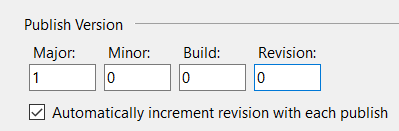
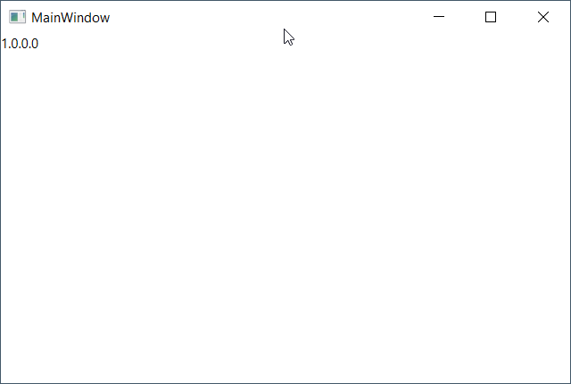

# Show the publish version in the app

1. MainWindow.xaml
```xaml
<TextBlock Name="version_lbl"/>
```
2. Add a reference to System.Deployment.dll
3. MainWindow.xaml.cs
```csharp
using System.Deployment.Application;
...
 public MainWindow()
        {
            InitializeComponent();
            if (ApplicationDeployment.IsNetworkDeployed)
            {
                var _version = ApplicationDeployment.CurrentDeployment.CurrentVersion;
                string v = $"{_version.Major}.{_version.Minor}.{_version.Build}.{_version.Revision}";
                version_lbl.Text = v;
            }
        }
```
4. Publish and install the app
